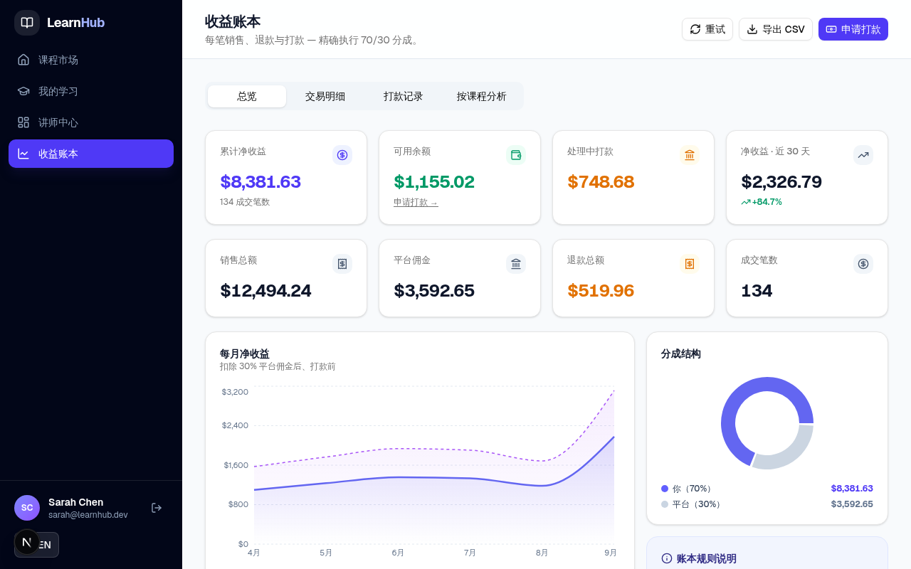

<div align="center">

# 🎓 LearnHub

### Online Courses Platform with Instructor Revenue Ledger

**Next.js 16 · React 19 · TypeScript · Prisma + SQLite · Tailwind CSS 4 · shadcn/ui · Recharts**

A full-stack course marketplace with a Stripe-style instructor revenue ledger, transparent 70/30 revenue split, payout workflow, and a complete admin panel — bilingual (English / 中文).

</div>

---

## ✨ Features

### 🛒 Marketplace (Public)
- Course catalog with search, category & level filters, sorting
- Course detail pages with syllabus accordion and sticky purchase card
- Instant checkout → transactional enrollment + revenue ledger entry
- **Shopping cart** — multi-course bulk checkout with persisted cart, order summary and coupon redemption
- **Coupon system** — storewide & course-scoped discount codes with usage caps, expiry dates and live validation
- **About & FAQ pages** — mission, story, values, milestones + grouped Q&A
- Professional multi-column footer + promo banner

### 🎓 Student
- "My Learning" dashboard with course progress cards
- Complete purchase history with prices and dates
- Course player, reviews, wishlist, certificates of completion

### 👨‍🏫 Instructor
- **Dashboard**: earnings stats, revenue area chart, per-course performance table
- **Coupon management** — create course-scoped promo codes with discount %, usage caps and expiry; track redemptions
- **Revenue Ledger** (4 tabs):
  - **Overview** — lifetime earnings, available balance, monthly revenue trend, 70/30 split donut
  - **Transactions** — filterable ledger (sales / refunds) with running balance
  - **Payouts** — request payouts with 25 / 50 / 100% quick presets + full history
  - **By Course** — per-course earnings with share bars
- **CSV export** — merged transactions + payouts with summary footer

### 🛡️ Admin
- Platform GMV, revenue, and enrollment analytics
- **Payout approval queue**: approve → mark as paid, or reject with reason
- **Coupon management** — create storewide or course-scoped coupons, activate/deactivate, view usage
- User and course management

### 🌐 Platform
- Full **EN / 中文** language toggle (≈290 i18n keys)
- Role-based SPA routing with auth guards
- Responsive: desktop dashboard + mobile drawer navigation
- **Demo coupons**: `WELCOME25` (storewide −25%) · `LEARN10` (storewide −10%) · `SARAH30` / `DIEGO20` (course-scoped) · `EXPIRED15` / `BLACKFRIDAY50` (invalid states for testing)

## 📸 Screenshots

| Marketplace | Revenue Ledger |
|:---:|:---:|
|  |  |

## 🚀 Quick Start

```bash
# 1. Install dependencies
npm install          # or: bun install

# 2. Configure environment
cp .env.example .env
#    → edit DATABASE_URL to point at your local project path

# 3. Set up the database
npx prisma generate
npx prisma db push       # create SQLite schema
npx prisma db seed       # seed demo data (or skip — see note below)

# 4. Run
npm run dev              # → http://localhost:3000
```

> **Note:** the repository ships with a pre-seeded `db/custom.db` (19 users, 10 courses, ~214 transactions across 6 months, 11 payouts). If you keep it, you can skip `db push` + `db seed` and run immediately — just fix the `DATABASE_URL` path in `.env`.

## 👤 Demo Accounts

All passwords: `demo123`

| Role | Email | Explore |
|------|-------|---------|
| Student | `liam@student.dev` | Marketplace, checkout, My Learning |
| Instructor | `sarah@learnhub.dev` | Revenue Ledger, payouts, CSV export |
| Admin | `admin@learnhub.dev` | Payout approvals, platform stats |

One-click demo login buttons are available on the sign-in page.

## 🧮 Revenue Ledger Logic

- **SALE** → instructor earns 70% of gross (`netEarnings`), platform keeps 30% (`platformFee`)
- **REFUND** → negative entry linked to the original sale via `relatedTransactionId`
- **Payouts** → deducted from available balance; `PENDING` and `APPROVED` both **reserve** funds until `PAID` / `REJECTED`
- Balance = lifetime net earnings − refunds − reserved & completed payouts

## 🗂 Project Structure

```
prisma/schema.prisma        # User · Course · Lesson · Enrollment · Transaction · Payout
prisma/seed.ts              # Deterministic seed (~214 txns, 6 months of history)
src/
├── app/page.tsx            # SPA entry — role-based view routing
├── app/api/                # 9 REST routes: auth, courses, enrollments,
│                           # ledger, payouts (+state machine), admin stats, CSV export
├── components/platform/    # marketplace, course detail, dashboards,
│                           # revenue-ledger, admin-panel, app shell, auth
├── lib/ledger.ts           # computeLedger(): balance, monthly buckets, per-course
├── lib/i18n.tsx            # EN/中文 dictionaries + LanguageProvider
├── lib/format.ts           # money/date formatting helpers
└── store/app.ts            # Zustand: user · language · view · checkout intent
```

## 🛠 Tech Stack

| Layer | Choice |
|-------|--------|
| Framework | Next.js 16 (App Router) · React 19 · TypeScript |
| Database | Prisma ORM + SQLite |
| UI | Tailwind CSS 4 · shadcn/ui · lucide-react icons · sonner toasts |
| Charts | Recharts (area · donut · bar) |
| State | Zustand + persist |

## 📄 License

MIT — use it freely for learning and portfolio projects.
